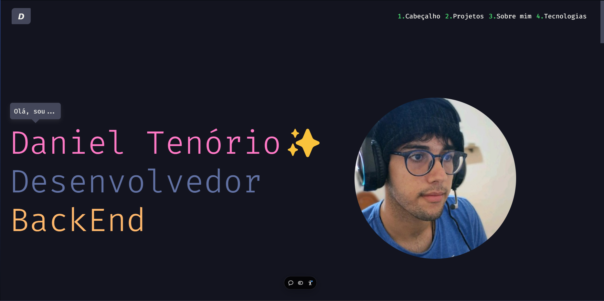

# Meu novo Portifolio✨



### Sobre o projeto 💪

> Novo portfólio desenvolvido com Vite, React e TypeScript, apresentando quem sou, meus novos projetos e experiências. A estrutura foi reformulada para oferecer uma abordagem mais intuitiva e envolvente para quem visita.

## Requisitos 💻

Antes de clonar o projeto e recomendado você ter os seguintes requisitos:

-   Precisa ter `Node` instalado.
-   Necessario `GIT` para clonar.
-   Sua maquina `Windows, Linux ou Mac`.
-   Conhecimento basico em `Typescript`.

## Tecnologias 🚀

As principais tecnologias e ferramentas utilizadas neste projeto são:

-   `Node.js`: Ambiente de execução para JavaScript no lado do servidor.
-   `React`: Biblioteca JavaScript para criação de interfaces de usuário.
-   `TypeScript`: Superset do JavaScript que adiciona tipagem estática opcional.
-   `Vite`: Ferramenta de construção rápida para projetos em ReactTS.
-   `Bootstrap`: Framework CSS para design responsivo.

## Como instalar 🚀

Windows, Linux e macOS

```
git clone https://github.com/danielBRTanimacao/danieltenorioportfolio.git
cd danieltenorioportfolio
npm i
npm run dev
```

### Contato 📞

-   Nome: Daniel Tenório
-   Email: danieltenorio2046@gmail.com
-   LinkedIn: [Meu LinkedIn](https://www.linkedin.com/in/daniel-tenório-6471b0244/)

<p align="center">Feito com ❤️ por <strong>Eu :D</strong></p>
